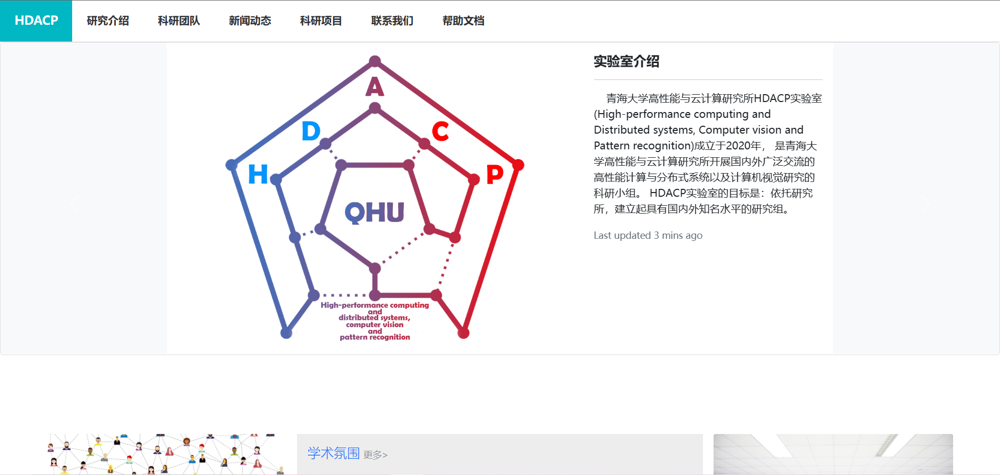
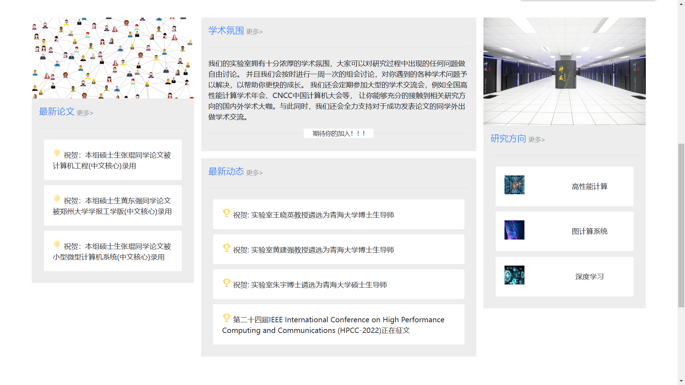
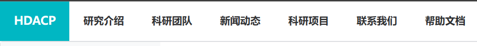
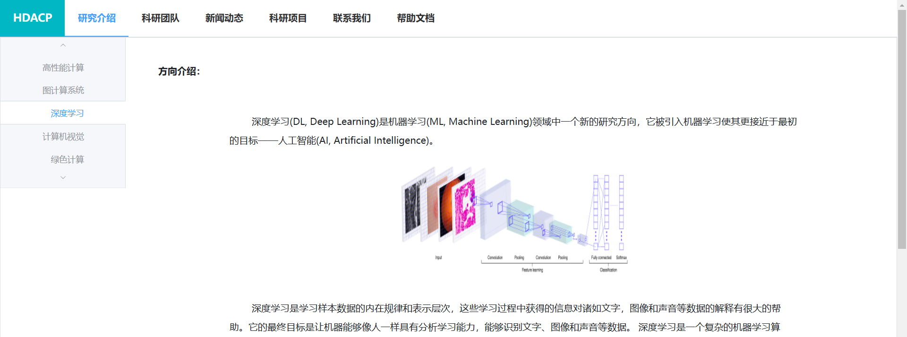
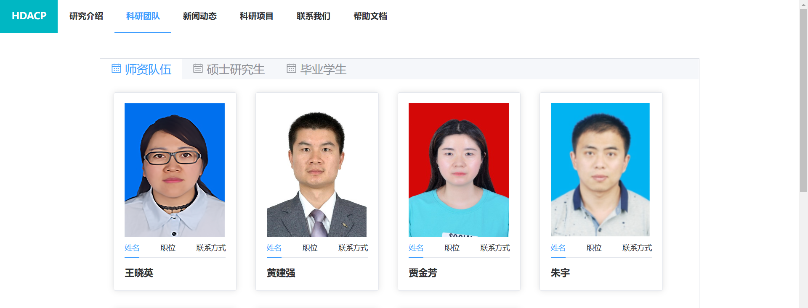
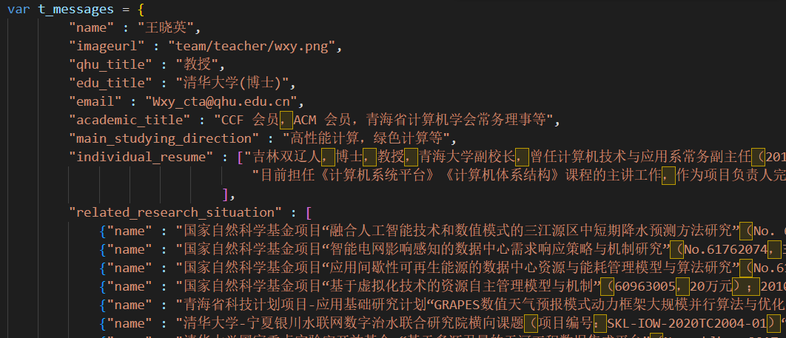
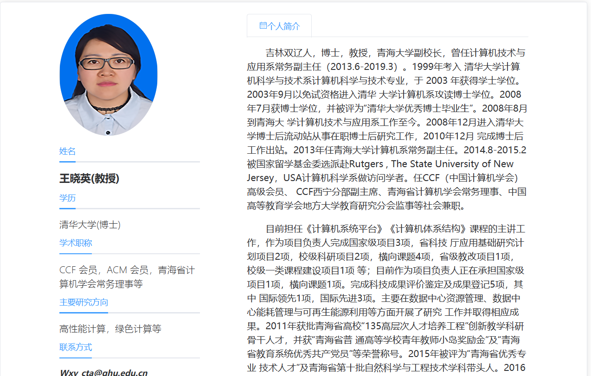
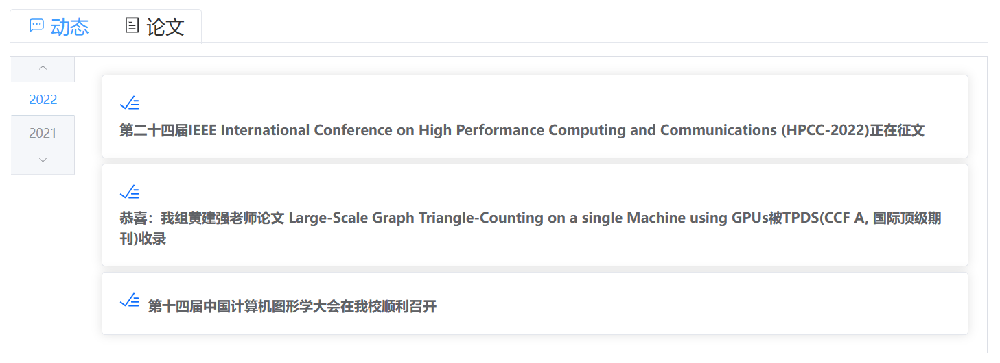
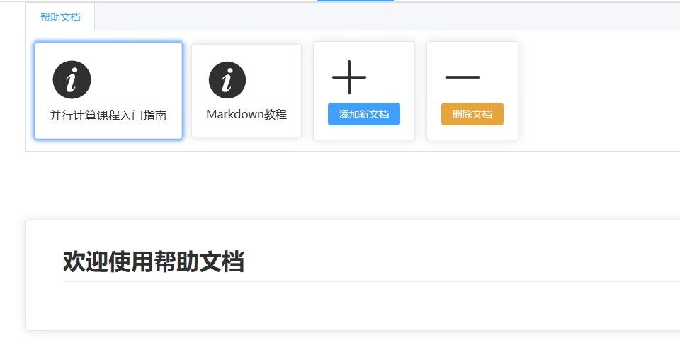
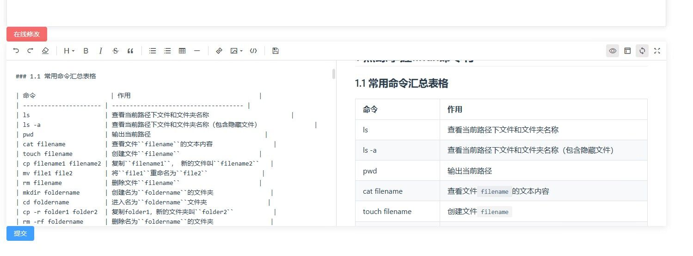

# 
HDACP实验室管理系统

**
成员：莫康龙  姚宇
**

----------------------

## 1. 页面介绍

 青海大学高性能与云计算研究所HDACP实验室(High-performance computing and Distributed systems, Computer vision and Pattern recognition)成立于2020年， 是青海大学高性能与云计算研究所开展国内外广泛交流的高性能计算与分布式系统以及计算机视觉研究的科研小组。 HDACP实验室的目标是：依托研究所，建立起具有国内外知名水平的研究组。目前[HDACP首页](https://www.qhu-hdacp.cn/)代码难以维护，排版略显老旧，故此次大作业的任务便是将网站重构，将内容和排版解耦，各个内容尽可能模组化，以方便后续管理维护，尽可能使网站活力、大方、美观。

## 2. 框架介绍

我们前端使用了vue3、bootstrap5以及element-plus。后端框架采用了python flask库。

### 2.1 [vue框架](https://cn.vuejs.org/guide/introduction.html)

Vue是一款易学易用、性能出色、生态丰富的渐进式的 JavaScript 框架。不仅体积小，而且支持双向数据绑定，让开发者把更多精力投入业务逻辑中。同时独特的组合式API风格和单文件组件让初学者记忆深刻。近几年和React、Angular并称前端框架三巨头。

### 2.2 [bootstrap5](https://v5.bootcss.com/docs/getting-started/introduction/)

bootstrap是一个出色地打包了多种功能的前端工具包。可以很方便在短时间内构建任何产品页面。来自 Twitter，是目前最受欢迎的前端框架。Bootstrap 是基于 HTML、CSS、JAVASCRIPT 的，它简洁灵活，使得 Web 开发更加快捷。

### 2.3 [element-plus](https://element-plus.gitee.io/zh-CN/)

一致 Consistency[#](https://element-plus.gitee.io/zh-CN/guide/design.html#%E4%B8%80%E8%87%B4-consistency)
-------------------------------------------------------------------------------------------------------

* **与现实生活一致：** 与现实生活的流程、逻辑保持一致，遵循用户习惯的语言和概念；

* **在界面中一致：** 所有的元素和结构需保持一致，比如：设计样式、图标和文本、元素的位置等。

反馈 Feedback[#](https://element-plus.gitee.io/zh-CN/guide/design.html#%E5%8F%8D%E9%A6%88-feedback)
-------------------------------------------------------------------------------------------------

* **控制反馈：** 通过界面样式和交互动效让用户可以清晰的感知自己的操作；

* **页面反馈：** 操作后，通过页面元素的变化清晰地展现当前状态。

效率 Efficiency[#](https://element-plus.gitee.io/zh-CN/guide/design.html#%E6%95%88%E7%8E%87-efficiency)
-----------------------------------------------------------------------------------------------------

* **简化流程：** 设计简洁直观的操作流程；

* **清晰明确：** 语言表达清晰且表意明确，让用户快速理解进而作出决策；

* **帮助用户识别：** 界面简单直白，让用户快速识别而非回忆，减少用户记忆负担。

可控 Controllability[#](https://element-plus.gitee.io/zh-CN/guide/design.html#%E5%8F%AF%E6%8E%A7-controllability)
---------------------------------------------------------------------------------------------------------------

* **用户决策：** 根据场景可给予用户操作建议或安全提示，但不能代替用户进行决策；

* **结果可控：** 用户可以自由的进行操作，包括撤销、回退和终止当前操作等。

### 2.4 [python flask](https://flask.net.cn/)

随着你的代码库日益壮大，你可以自由地决定设计目标。 Flask 会一直提供一个非常 简约而优秀的胶合层，就像 Python 语言一样。你可以自由地使用 SQLAlchemy 执行高级 模式，或者使用其他数据库工具，亦可引入非关系数据模型，甚至还可以利用用于 Python 网络接口 WSGI 的非框架工具。  

## 3. 效果展示

### 3.1 首页效果

抛去导航栏，首页主体由上下两部分组成：上方的ppt和下方的内容展示。上方的ppt动效来自于bootstrap5的carousel，可以通过左右的方向标志来切换所展示给用户的内容。在代码中，<style>标签中引入bootstrap的css部件并修改部分css属性，即可完成调用。

下方的内容展示部分中，使用了bootstrap中card堆叠而成，对HDACP队伍内容进行简要概括以及阐述。所示内容与状态栏中的各个分栏并无差别。

### 3.2 导航栏

本次导航栏做到了代码复用。由于导航栏的使用是全局统一的，而一个一个的手动同步代码显得太傻而且难以维护，一个导航栏代码挂载多个页面成了更好的选择。导航栏框架采用了element-plus中的el-menu组件，方便调用。整体采用了扁平式设计，更接近近年来互联网大厂的网页设计审美偏好，并且在光标悬停在选项上方时还会出现颜色变化，优美而不显突兀。

### 3.3 研究介绍

研究介绍的内容是分几部分的，由researchIntro.vue文件进行统一管理。后续维护中只需直接添加几乎没有格式的页面，并在researchIntro中按照格式添加导入内容即可，新的文章内容即可挂载到研究介绍中。

### 3.4 科研团队

科研团队中，是介绍HDACP中老师、硕士研究生以及毕业生的页面。我们将原本三组人员的页面进行了折叠，客户根据需要点击即可。

  

而在老师的个人介绍页面中，由于有些老师资历较深，科研荣誉非常多，我们将老师的大篇幅的科研介绍和页面格式完全解耦，将科研荣誉等内容进行类json化存储，在生成页面时直接进行文件内容读取并程序化生成页面，便于后续添加内容，维护网站。

### 3.5 新闻动态

新闻动态中，新闻和论文收录情况也做了相应的归纳折叠，以及一定的动效处理。

### 3.6 科研项目和联系我们

这两个页面仅仅是两个静态的表格，在此基础上并没有其他的创新，在此不做过多介绍

### 3.7 帮助文档（markdown特色文档）

帮助文档这里采用了后端存储管理。与后端的通信使用了axios，后端使用flask与mysql数据库。

添加新文档后可以直接点击文档并查看内容，可以直接解析markdown格式的特色内容，比如表格。如果对文档内容不满意，可以直接进行在线修改并且实时预览markdown效果。

## 4. 环境搭建

环境搭建内容参考链接[https://github.com/Xiamu-ssr/Web/blob/main/README.md](https://github.com/Xiamu-ssr/Web/blob/main/README.md)

